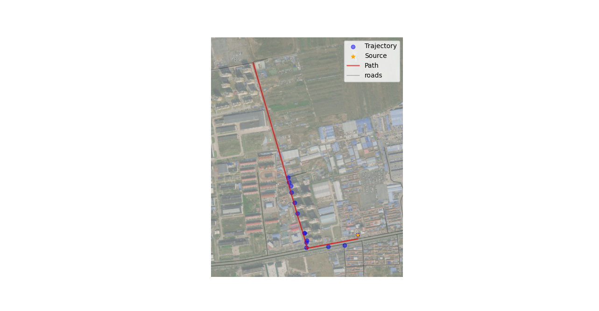

# introduction
graduation project，base on python，ST matching algorithm，etc


<br><br><br>
## 使用示例
```python
    set_start_method('spawn')
    """step 1: 获取/加载路网"""
    # # 方法1：
    # 根据 bbox 从 OSM 下载路网，从头解析获得路网数据
    #net = build_geograph(bbox=[116.733964, 39.529005, 116.7687035, 39.5589197],
    #                    xml_fn="./data/network/LF.geojson", ll=False)
    # # 将预处理路网保存为 ckpt
    #net.save_checkpoint('./data/network/LF_graph.ckpt')

    # 方法2：
    # 使用预处理路网
    net = build_geograph(ckpt="./data/network/LF_graph.ckpt")  # 函数返回一个地理图（GeoDigraph）对象。
```
```python
    """step 2: 创建地图匹配 matcher"""
    matcher = ST_Matching(net=net, ll=False)
    # plot_geodata(net.df_edges.to_crs(4326))
    # net.df_edges.head(5)
```

```python
    """step 3: 加载轨迹点集合"""
    idx = 22      # 2,4,5,6,7,8,14,21,22
    traj = matcher.load_points(f"./data/trajs/traj_{idx}.geojson").reset_index(drop=True)
    res = matcher.matching(
        traj,
        top_k=5,
        plot=True,
        details = True

    )  # 这段代码定义了一个名为matching的方法，通过匹配轨迹（traj）和地理图（graph）来获取匹配结果。

    # plot_geodata(net.df_edges.to_crs(4326))
    # plt.show()
    """ 这段代码定义了一个名为`matching`的方法，通过匹配轨迹（traj）和地理图（graph）来获取匹配结果。
```

方法的参数如下：
- `traj`：要匹配的轨迹对象。
- `top_k`（可选）：选择和考虑的候选匹配的数量。默认为`None`。
- `dir_trans`（可选）：是否进行方向转换。默认为`False`。
- `beam_search`（可选）：是否使用beam搜索。默认为`True`。
- `simplify`（可选）：是否对轨迹进行简化处理。默认为`True`。
- `tolerance`（可选）：简化轨迹时的公差（tolerance）。默认为`5`。
- `plot`（可选）：是否绘制匹配结果的图形。默认为`False`。
- `save_fn`（可选）：保存匹配结果图形的文件名。默认为`None`。
- `debug_in_levels`（可选）：是否以级别为单位进行匹配调试。默认为`False`。
- `details`（可选）：是否返回匹配的详细信息。默认为`False`。
- `metric`（可选）：计算匹配质量评估时使用的度量。默认为`None`。
- `check_duplicate`（可选）：是否检查轨迹中重复的点。默认为`False`。
- `check_topo`（可选）：是否检查匹配结果的拓扑关系。默认为`False`。
- `search_radius`（可选）：空间分析时的搜索半径。默认为`None`。
    
```python
    # 后续步骤可按需选择
    """step 4: 将轨迹点映射到匹配道路上"""
    path = matcher.transform_res_2_path(res, ori_crs=True)  # 返回最终的路径对象
    proj_traj = matcher.project(traj, path)  # 将点投影到由GeoDataFrame表示的路径上

    """step 5: eval"""
    matcher.eval(traj, res, resample=5, eps=10)
```

staus：状态 为0 状态设置为成功  
ori_crs（原始坐标系，默认为True）  
dist: 1251 路径的总距离。  
avg_speed: 平均速度  
dist_prob：距离概率。  
tran_prob:转换概率。  
norm_prob: norm_prob 是经过归一化处理后的概率值，用于统一不同度量标准下的概率。  
prob：prob 通常代表原始的概率值，可能是匹配路径的概率或路径质量的某个度量。  


<br><br><br>
## 结果

